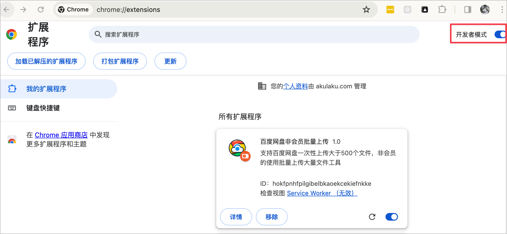

<h1 align="center">百度云非会员批量上传插件</h1>

支持非会员上传超过500个文件的Chrome浏览器插件

## 简介

这是一个用于百度云的浏览器插件，旨在解决非会员用户一次只能上传500个文件的限制。它允许用户一次性无限制地上传大于500个文件，提供了更便捷的文件上传体验。

https://github.com/passmetheplay/baiduyunbatchupload/assets/143151096/cbbfd8ff-acdd-427b-a44a-d700ed51d04c

## 功能

- 非会员一次性上传大量文件(超过500)，无需分批操作；
- 支持文件夹上传；
- 简单易用的用户界面，无需繁琐的操作。

## 如何使用

1. 安装插件：
   - 可以通过 [Chrome商店](https://chromewebstore.google.com/detail/jdlhackplclofcomhipgfdocncamjjna?hl=zh-CN&authuser=2) 链接下载，也可以使用离线文件安装。
   - 离线安装： 下载[baiduyunbatchupload.zip](https://github.com/passmetheplay/baiduyunbatchupload/releases/download/1.0.0/baiduyunbatchupload.zip)后，打开chrome浏览器，输入chrome://extensions/，打开开发者模式，然后“加载已解压的扩展”即可，具体见下面。
3. 打开百度云我的文件，然后打开到你需要上传文件的目录。
4. 点击右上角的百度云批量上传插件，然后点击'显示上传工具栏',上传工具栏会显示在百度云页面的顶部。
5. 点击'选择文件/文件夹'按钮，选择需要上传的文件，然后点击'开始'按钮，上传文件。

## 安装

您可以从以下链接下载和安装插件：

1. [下载插件](https://github.com/passmetheplay/baiduyunbatchupload/releases/download/1.0.0/baiduyunbatchupload.zip)  `新版本的Chrome不支持.crx后缀安装。`
   - 离线下载： 下载baiduyunbatchupload.zip并解压后，打开chrome浏览器，输入chrome://extensions/；
   - 打开开发者模式：插件管理页面右上角开发者模式开启；
      
   - 点击“加载已解压的扩展”，选择下载的baiduyunbatchupload.zip文件夹即可。
     
     
2. [Chrome商店](https://chromewebstore.google.com/detail/jdlhackplclofcomhipgfdocncamjjna?hl=zh-CN&authuser=2) 链接下载安装。

## 兼容性

目前只支持chrome浏览器，后期视需求而定。

## 开发

如果您希望为这个插件做出贡献或自行开发，您可以按照以下步骤进行：

1. 克隆这个仓库到您的本地计算机。
2. 打开浏览器的开发者模式，并加载未打包的扩展程序（详细步骤请参考浏览器文档）。
3. 在本地进行修改和测试。
4. 提交 Pull Request，贡献您的改进。

## 版权和许可

这个项目基于 MIT 许可证。详情请查看 [MIT LICENSE](https://opensource.org/license/mit/) 文件。

## 支持

如果您在使用插件过程中遇到问题或有建议，请创建一个 Issue，我们会尽力提供支持。

## 特别鸣谢

我们要感谢所有为这个项目做出贡献的开发者和社区成员。

## 更多信息

了解更多关于这个插件的信息，请访问我们的 [项目主页](https://github.com/yourrepository)。

